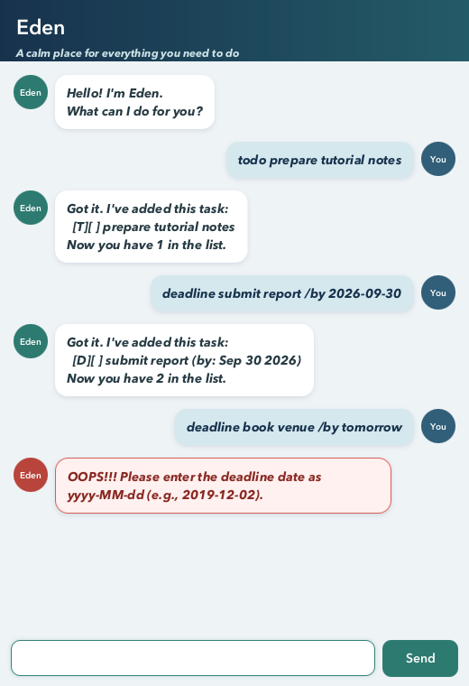

# Eden User Guide



Eden is a friendly desktop task manager that keeps todos, deadlines, and
events in one simple conversation. Type a command in the box at the bottom and
press **Enter** or click **Send**. Eden saves successful changes automatically,
so your tasks are restored the next time you start the app.

## Quick start

1. Install Java 25.
2. Place `eden.jar` in the folder from which you want to run Eden.
3. Run `java -jar eden.jar` in a terminal.
4. Enter `list` to see your current tasks or add your first task with
   `todo read a book`.

Eden stores tasks in `data/eden.txt`, relative to the folder from which it is
run. A missing data file is normal; Eden starts with an empty task list and
creates the file after the first successful change.

## Command summary

| Action | Command |
| --- | --- |
| Add a todo | `todo DESCRIPTION` |
| Add a deadline | `deadline DESCRIPTION /by YYYY-MM-DD` |
| Add an event | `event DESCRIPTION /from START /to END` |
| Show all tasks | `list` |
| Find matching tasks | `find KEYWORD` |
| Mark a task complete | `mark NUMBER` |
| Mark a task incomplete | `unmark NUMBER` |
| Delete a task | `delete NUMBER` |
| Exit Eden | `bye` |

Command words and separators such as `/by`, `/from`, and `/to` are not
case-sensitive. Task numbers are the numbers shown by `list`.

## Adding tasks

### Todo

Use `todo DESCRIPTION` for a task without a date or time.

Example: `todo read a book`

```text
Got it. I've added this task:
  [T][ ] read a book
Now you have 1 in the list.
```

### Deadline

Use `deadline DESCRIPTION /by YYYY-MM-DD`. The date must be a real calendar
date written in ISO format.

Example: `deadline submit report /by 2026-09-30`

```text
Got it. I've added this task:
  [D][ ] submit report (by: Sep 30 2026)
Now you have 2 in the list.
```

### Event

Use `event DESCRIPTION /from START /to END`. Start and end values can be
friendly text such as `2pm`, `Monday morning`, or `Zoom`.

Example: `event project demo /from 2pm /to 3pm`

```text
Got it. I've added this task:
  [E][ ] project demo (from: 2pm to: 3pm)
Now you have 3 in the list.
```

## Viewing and finding tasks

Enter `list` to display every task with its current number.

```text
Here are the tasks in your list:
1.[T][ ] read a book
2.[D][ ] submit report (by: Sep 30 2026)
3.[E][ ] project demo (from: 2pm to: 3pm)
```

Use `find KEYWORD` to display tasks whose descriptions contain that text.
Search is not case-sensitive.

Example: `find report`

## Updating tasks

Use the number shown by `list`:

- `mark 2` marks task 2 as complete.
- `unmark 2` marks task 2 as incomplete again.
- `delete 2` permanently removes task 2.

The remaining tasks are renumbered after a deletion, so run `list` again before
performing another numbered command.

## Exiting

Enter `bye` to close Eden. Successful changes have already been saved.

## Errors and recovery

Eden highlights errors in red and explains how to correct common problems,
including missing descriptions, invalid dates, malformed commands, nonexistent
task numbers, unreadable data, and failed saves. If saving fails, Eden keeps its
in-memory task list unchanged so it does not claim that an unsaved update
succeeded.

If `data/eden.txt` was edited manually and Eden reports malformed data, repair
the stated line or restore a valid copy before restarting Eden.

## Acknowledgements

Eden's implementation and visual design do not reuse external code or visual
assets.
